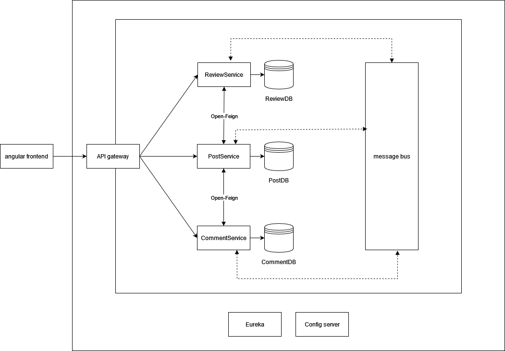

# Architecture

Below is the architecture of this project. It starts with an angular frontend that connects with a java backend through the API gateway. Within the java backend there are 3 services with each there own database. All services connect to the message bus. The Reviewservice and the PostService and the PostService and the CommentService are connected via Open-Feign.  There is also a Eureka and Config server present in the java backend.

there is also a .drawio file to view the diagram in [draw.io](https://www.draw.io)